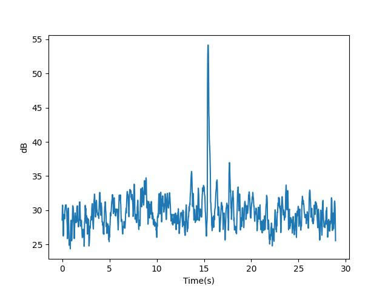

# 何をするツール？
wav形式の音声ファイルから以下のような画像を作成します。
 

騒音を記録するに当たり、意外にもdBを視覚的に記録出来るソフトが見当たらなく、参考記事を元に作成しました。

# 使い方
## 環境構築
1. python -m venv .venv
1. Set-ExecutionPolicy RemoteSigned -Scope CurrentUser -Force
1. python -m pip install -r requirements.txt

## 起動
1. .venv\Scripts\activate.ps1
1. python main.py "20231023"

# 参考
- 環境構築周り
  - https://www.python.jp/install/windows/venv.html
- プログラム
  - https://miseruit.com/2023/08/30/post-5561/
- 0dBの基準値
  - https://www.m-system.co.jp/mstoday/plan/mame/2020-2021/2001/index.html
- 騒音調査
  - https://www.skklab.com/standard_value
